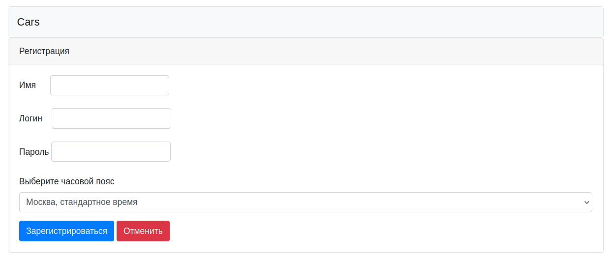
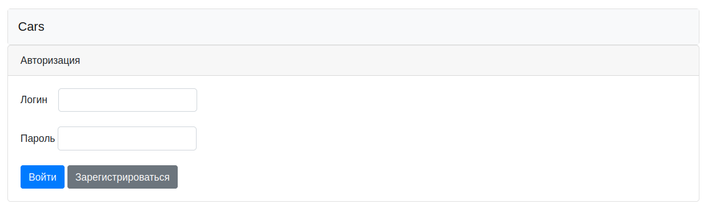
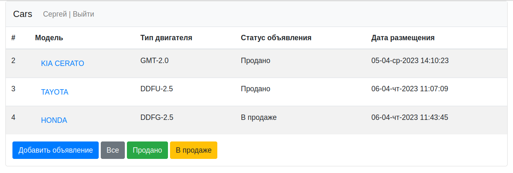
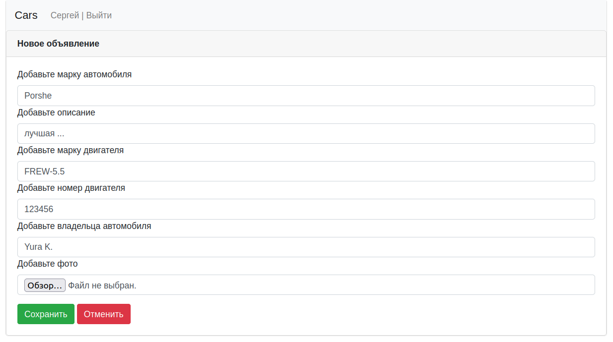
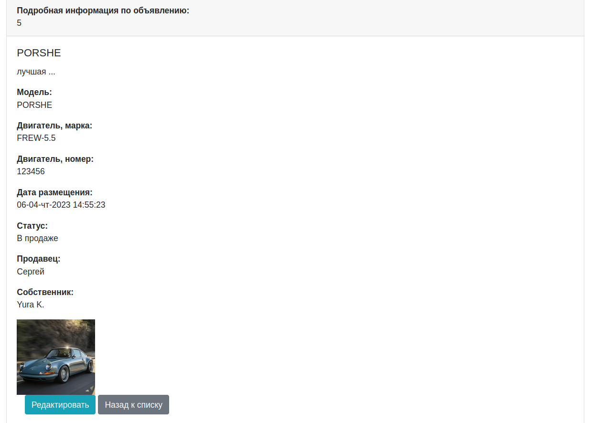
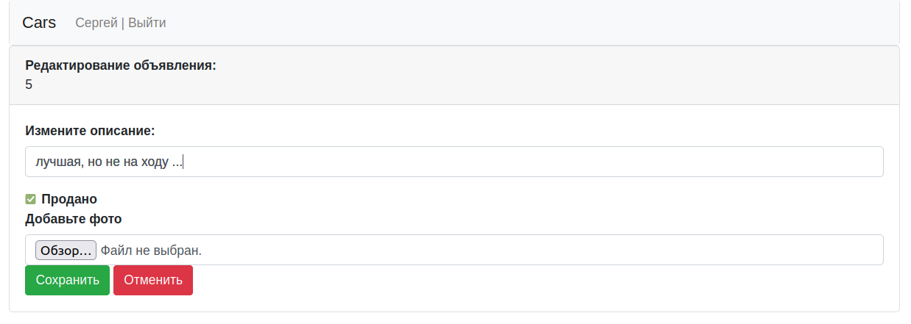

# job4j_cars

[](https://github.com/SergeyPoletaev/job4j_cars/actions)
[](https://codecov.io/gh/SergeyPoletaev/job4j_cars)

### Описание проекта:

Это приложение - сервис по продаже автомобилей. 
На веб-сайте размещаются объявления. В объявлении указано: 

* марка автомобиля
* тип двигателя
* описание
* фото

Пользоваться сервисом могут только зарегистрированные пользователи.  
Пользователь имеет возможность добавлять и редактировать объявления.  
Имеется возможность вывода списка объявлений по фильтру.  
Каждое объявление имеет статус: продано или актуально.  
Изменить описание или статус в объявлении может только пользователь его создавший.

### Стек технологий:

* Java 17
* Maven 3.8
* Spring Boot 2
* Thymeleaf 3
* Bootstrap 5
* PostgreSQL 14
* JDBC
* Liquibase

### Требования к окружению:

* Java 17
* Maven 3.8
* PostgreSQL 14

### Запуск проекта:

1. Настроить подключение к серверу БД в соответствии с настройками из файла    
   [./job4j_cars/src/main/resources/hibernate.cfg.xml](https://github.com/SergeyPoletaev/job4j_cars/blob/master/src/main/resources/hibernate.cfg.xml)   
   В случае изменения настроек подключения к БД привести в соответствие также настройки в файле  
   [./job4j_cars/db/liquibase.properties](https://github.com/SergeyPoletaev/job4j_cars/blob/master/db/liquibase.properties)
2. Создать базу данных, например через утилиту psql:

``` 
create database cars 
```

3. Создать таблицы нужной структуры и упаковать проект в jar архив. Для этого в папке с проектом выполнить:

``` 
mvn package -Pproduction 
```  

Архив jar будет находится по пути: ./job4j_cars/target/job4j_cars-1.0.jar

4. Запустить приложение командой:

``` 
java -jar job4j_cars-1.0.jar 
```

### Взаимодействие с приложением:

*регистрируемся ...*



*аутентифицируемся ...*



*список всех объявлений ...*



*добавляем новое ...*



*смотрим подробное описание ...*



*редактируем ...*



---

### Контакты

telegram: [@svpoletaev](https://t.me/svpoletaev)

